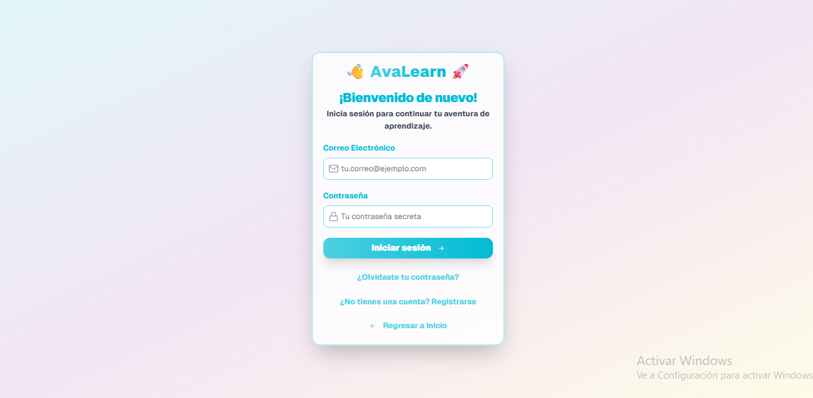
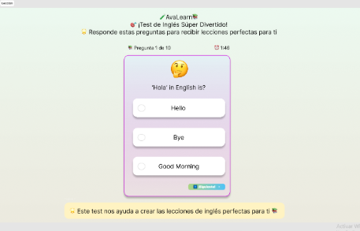
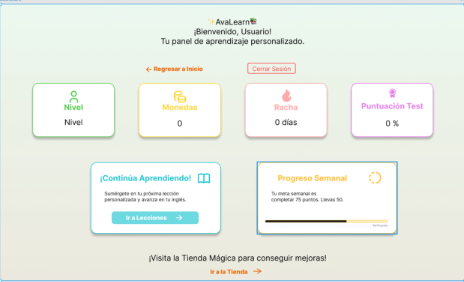

<h1>🧒 AVALEARN</h1>

<strong>Sistema De Aprendizaje De Inglés Con Avatares Personalizables Para Niños</strong>

 
<h4>🎯 Objetivo General</h2>

Desarrollar una plataforma web interactiva y gamificada diseñada para enseñar inglés a niños menores de 11 años mediante avatares personalizables y retroalimentación inmediata, promoviendo el aprendizaje lúdico, motivador y efectivo de habilidades lingüísticas básicas.

 
<h4>👩‍💻 Autores</h4>

- Ayol  Nayely - Catagña Esteban - Galeas Emily - Perez Alessia

 
<h4>👁 Previsualización del sistema</h4>

  

    
    <h4>Login</h4>
  

  

    
    <h4>Formato de Lecciones</h4>
  

  

    
    <h4>Dashboard</h4>
  

 
<h4>📥Descarga del sistema</h4>
<a href="https://drive.google.com/drive/folders/1_OxZF_56uxJZ9FPlxiHGa0J8Ke3POv5q?usp=sharing" target="_blank">
  Descargar AvaLearn (.exe)
</a>
